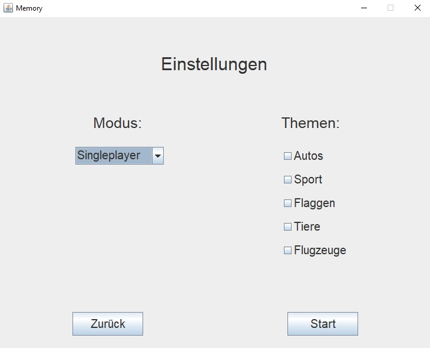
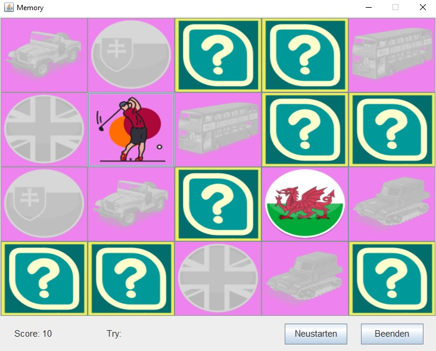
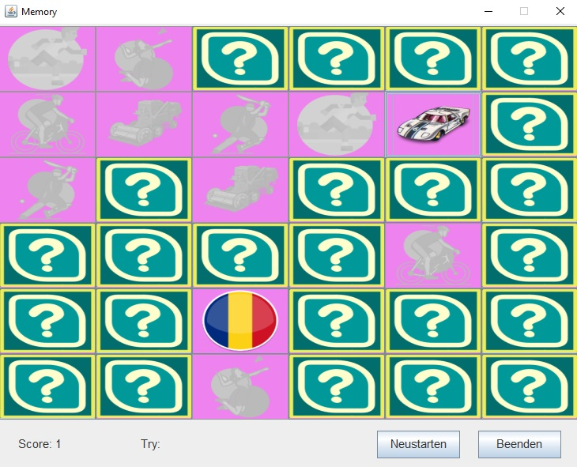
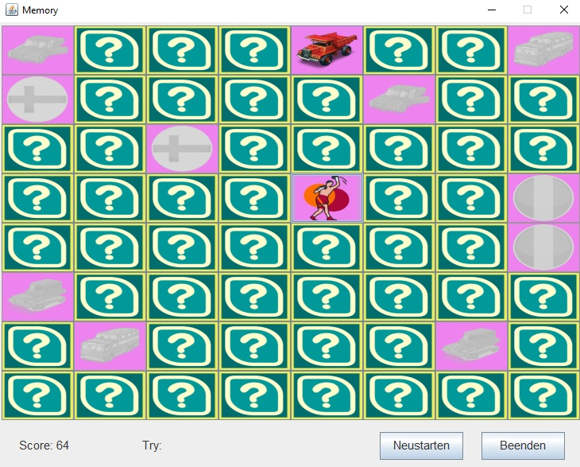

# Memory Game

This is a simple implementation of a Memory Game in Java using Swing. The game features a grid of cards, and the objective is to match pairs of cards with the same image.

### Features

- 4 Themes : `Cars`, `Sport`, `Flags` & `Animals`
- 3 types of difficulties : `4 x 5`, `6 x 6` & `8 x 8`
- Singleplayer : every try costs points, the game is lost when the score reaches 0
- Player vs Player : players take turns, finding a pair gives another turn, the player with the most pairs wins
- Ranking : singleplayer wins are saved with the player name and shown as a top 10 per difficulty

## Dependencies

- Java 17 or newer
- Java Swing library

## How to run

Run from the project root, so the game finds the `icons` folder:

```
javac -d out $(find src -name "*.java")
java -cp out Main
```

The ranking is saved to `ranking.txt` in the project root.

### Next

- [X] 2 player game
- [X] Ranking
- [ ] Player vs Bot
- [ ] Database support
- [X] Score tracking
- [X] Reset button to restart the game


## Screenshots







